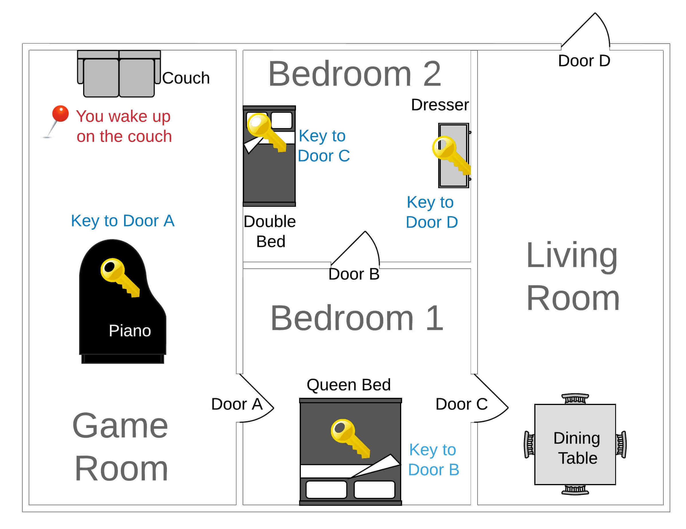

# Project: Escape Room Python Game

<br />


## Description

Escape Room Game, created in Python for our Master's in Data Science & Machine Learning at Ironhack.




<br />


## How to run


1. Clone the repository:

```shell
git clone https://github.com/mariaaguilarvega/scape_room_project
```

2. Install dependencies:

```shell
pip install -r requirements.txt
```


3. Run:

```shell
python code/scape_room_game.py
```

<br />


## Contributors

- Maria Aguilar (https://github.com/mariaaguilarvega)
- Patricia Giménez (https://github.com/patricia-gimsa)
- Luis Junco (https://github.com/luisjunco)

<br />

